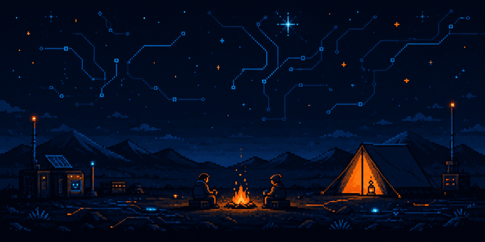

  

# Gustavo Harnisch

### Junior Data & BI Developer · Competitive Programmer (ICPC) · Computer Engineering Student

**SQL · Oracle · Node.js · REST APIs · Algorithms & Data Structures (C++)**

Transforming structured data into reliable applications, and solving hard algorithmic
problems under pressure — same discipline, two angles.

  
  
  
  

---

### About

I'm a **Civil Computer Engineering student based in Chile**, building my career at the
intersection of **Data/BI engineering** and **competitive programming**.

On one side, I turn messy information into clear queries, solid data models, and
dashboards that support real decisions. On the other, I train and compete in algorithmic
problem solving — three consecutive years representing my university at the **ICPC
Regional Chile** (2023–2025, best result: 9th place nationally, 2023).

Both sides feed the same skill: breaking down a hard problem, reasoning about
correctness and efficiency, and shipping something that actually works.

> 🔎 Currently open to **internships, trainee programs and entry-level roles** in Data,
> Backend, or Algorithm-heavy engineering — Chile or remote.

---

### Technical Focus

| Area                        | Technologies and concepts                            |
| :-------------------------- | :--------------------------------------------------- |
| **Data & BI**               | SQL · Oracle · Data modeling · Dashboards            |
| **Backend & APIs**          | Node.js · Python · REST APIs · Database integration  |
| **Algorithms & Structures** | C++ · Competitive programming · DP, graphs, geometry |
| **Programming Foundations** | C++ · Rust · JavaScript                              |
| **Tools & Systems**         | Git · GitHub · Linux                                 |

---

### Competitive Programming

🏅 **ICPC Regional Chile** — active competitor 2023–2025 (best result: 9th place
nationally, 2023).

Organized the **1st Internal Programming Tournament at UCM** (2026), an ICPC-style
contest on Codeforces, and maintain **[CICP-2026](https://github.com/Gustavo-Harnisch/CICP-2026)**,
a study index covering DP, graphs, strings, geometry and data structures for teams
preparing for regional competitions.

---

### Featured Project

#### [CRUD Oracle](https://github.com/Gustavo-Harnisch/CRUD-oracle)

Database-driven backend application built with **Oracle XE 21c** and **Node.js**,
focused on reliable communication between a REST API and an enterprise relational
database.

**Main features**

* CRUD operations connected to Oracle Database
* REST API built with Node.js
* Input validation and error handling
* Relational data modeling

`Node.js` · `Oracle XE 21c` · `SQL` · `REST API` · `JavaScript`

[View repository →](https://github.com/Gustavo-Harnisch/CRUD-oracle)

---

### Support my work

  If my projects or resources have been useful to you, you can support their continued development.

 
Every contribution helps me continue learning, building and sharing open-source projects.

